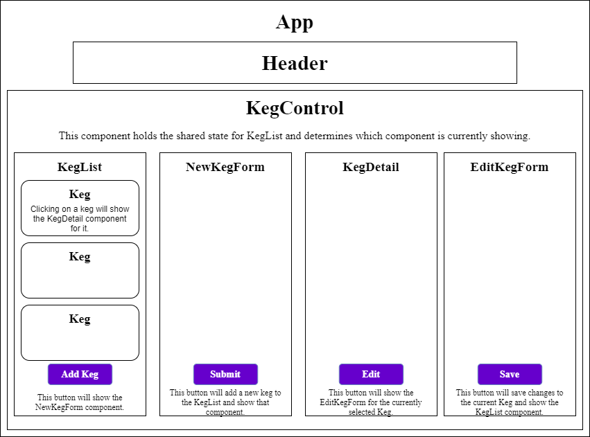

# Tap Room

#### By Deryck Jackson

## Description

A react app for tracking kegs.
User will be able to add, edit, delete and view details of each items which are displayed in a list.
App now uses redux.

## Component Diagram



## User Stories

* :heavy_check_mark: As a user, I want to see a list/menu of all available kegs. For each keg, I want to see its name, brand, price and alcoholContent.
* :heavy_check_mark: As a user, I want to submit a form to add a new keg to a list.
* :heavy_check_mark: As a user, I want to be able to click on a keg to see its detail page.
* :heavy_check_mark: As a user, I want to see how many pints are left in a keg. A full keg has roughly 124 pints.
* :heavy_check_mark: As a user, I want to be able to click a button next to a keg whenever I sell a pint of it. This should decrease the number of pints left by 1. Pints should not be able to go below 0.

## Stretch Goals

* As a user, I want the option to edit a keg's properties after entering them just in case I make a mistake.
* As a user, I want to be able to delete a keg.
* As a user, I want a keg to update to say "Out of Stock" once it's empty.
* As a user, I want kegs with less than 10 pints to include a message that says "Almost Empty" so I can try a pint before it's gone!
* As a user, I want to have kegs prices to be color-coded for easy readability. This could be based on their price, the style of beer or kombucha, or the amount of pints left.
* As a user, I want this application to be nicely styled. (Use stylesheets and CSS objects!)

## Setup and Installation
* Navigate to the parent directory you would like to store the project's directory in.
```
cd tap-room
```
* Clone the repository from github, and navigate to its directory.
```
git clone https://github.com/deryckjackson/tap-room.git
cd tap-room
```
* Install required dependencies.
```
npm install
```
* Run the application
```
npm run start
```
* Open your browser and navigate to `localhost:3000`

## Tech used

* Html
* CSS / Reactstrap
* Redux
* JavaScript
* React

### License

This project is licensed under the [MIT License](https://opensource.org/licenses/MIT).

Copyright (c) 2020 Deryck Jackson
